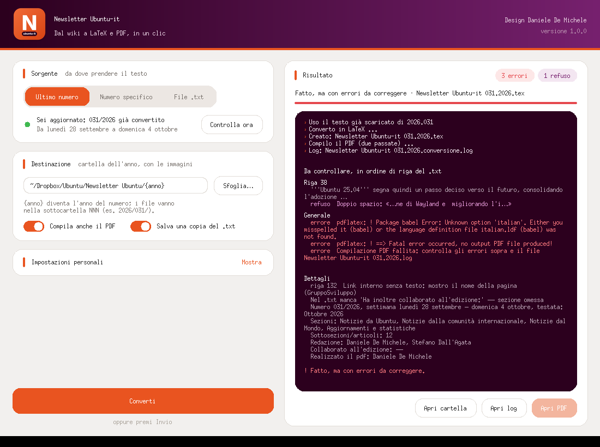
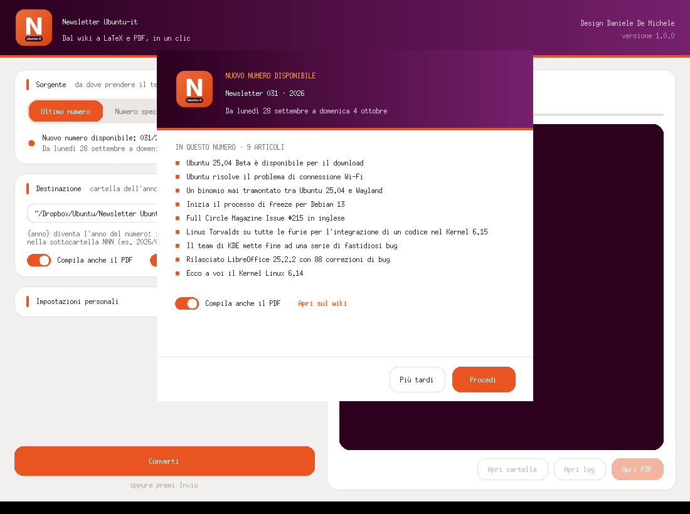
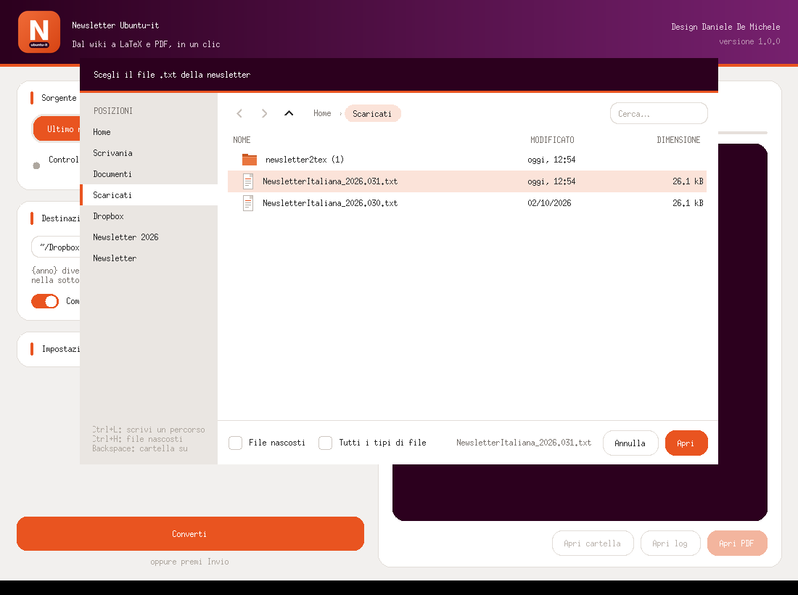

<p align="center">
  
</p>

<h1 align="center">newsletter2tex</h1>

<p align="center">
  Dal wiki di Ubuntu-it a LaTeX e PDF, in un clic.<br>
  Converte la <a href="https://wiki.ubuntu-it.org/NewsletterItaliana">Newsletter Ubuntu-it</a> dal formato wiki (MoinMoin) al file <code>.tex</code> dell'edizione PDF.
</p>

<p align="center">
  
  
  
</p>



## Cosa fa

Ogni settimana gli articoli della newsletter vengono scritti sul wiki e poi impaginati in LaTeX per l'edizione PDF. `newsletter2tex` automatizza questo passaggio:

- **Controlla il wiki** all'avvio e avvisa con un popup quando esce un numero non ancora convertito, mostrando settimana e titoli degli articoli. Con **Procedi** scarica il testo, lo converte e compila il PDF.
- **Converte il markup wiki** in LaTeX: sezioni, grassetto e corsivo, link interni ed esterni, liste annidate, righe "Fonte", statistiche del gruppo sviluppo, crediti.
- **Applica il template** dell'edizione PDF: frontespizio, colophon, indice, "Scrivi per la newsletter" e chiusura, con numero, anno, mese e date sempre aggiornati.
- **Segnala cosa correggere** nel testo prima della pubblicazione: markup non riconosciuto, link senza testo, apici non chiusi, refusi. Tutto è ordinato per riga del `.txt`.
- **Funziona sia con l'interfaccia grafica sia da terminale.** È un unico file Python, senza dipendenze esterne.

## Installazione

Requisiti: Ubuntu (o un'altra distribuzione Linux), Python 3.8 o superiore, `python3-tk` per l'interfaccia grafica e una distribuzione TeX con il supporto per l'italiano per compilare il PDF.

```bash
sudo apt install python3-tk texlive-latex-extra texlive-lang-italian
git clone https://github.com/danieledemichele/newsletter2tex.git
cd newsletter2tex
sh installa.sh
```

`installa.sh` copia il programma in `~/.local/bin/newsletter2tex`, aggiunge **Newsletter Ubuntu-it** al menu delle applicazioni con la sua icona e segnala eventuali pacchetti mancanti. Per aggiornare basta un `git pull` seguito da un nuovo `sh installa.sh`.

Per controllare quale versione è installata:

```bash
newsletter2tex --versione
```

## Interfaccia grafica

Si apre dal menu delle applicazioni oppure con:

```bash
newsletter2tex --gui
```

| Nuovo numero disponibile | Esplora file |
|---|---|
|  |  |

- **Sorgente**:
  - **Ultimo numero**: lo stato del wiki, con il pulsante "Controlla ora".
  - **Numero specifico**: un numero preciso, per esempio `2026.031`.
  - **File .txt**: un file già salvato.

  Con "Ultimo numero" non viene scaricato niente senza la tua conferma. Se ti sei perso più numeri, nel popup puoi spuntare anche quelli precedenti.
- **Destinazione**: la cartella dell'anno, cioè quella con le immagini. `{anno}` viene sostituito con l'anno del numero.
- **Esplora file**:
  - posizioni rapide come Home, Scaricati, Dropbox e la cartella della newsletter;
  - percorso cliccabile e ricerca;
  - i file `.txt` più recenti in alto, con l'ultimo già selezionato.

  Scorciatoie: `Ctrl+L` per scrivere un percorso, `Ctrl+H` per i file nascosti, `Backspace` per salire di una cartella.
- **Impostazioni personali**: il nome per "A cura di", chi realizza il PDF e i collaboratori predefiniti all'edizione. Vengono salvate in `~/.config/newsletter2tex/config.json` e valgono anche da terminale, così ogni collaboratore inserisce i propri dati una sola volta.
- **Risultato**:
  - errori, avvisi e refusi raggruppati per riga;
  - pulsanti per aprire la cartella, il log e il PDF.

## Uso da terminale

```bash
newsletter2tex --controlla              # c'è un numero nuovo da convertire?
newsletter2tex                          # scarica e converte l'ultimo numero
newsletter2tex -n 2026.031              # scarica e converte un numero preciso
newsletter2tex -f vecchio.txt           # converte un file .txt già salvato
newsletter2tex --pdf                    # compila anche il PDF
newsletter2tex -o ~/altra/cartella      # usa un'altra cartella dell'anno
newsletter2tex --edizione 'garakkio:Massimiliano Arione'
                                        # collaboratori all'edizione (sostituisce quelli del .txt)
```

## Dove finiscono i file

Ogni numero ha una propria sottocartella dentro la cartella dell'anno (predefinita: `~/Dropbox/Ubuntu/Newsletter Ubuntu/<anno>/`):

```
Newsletter Ubuntu/2026/
├── newlogo1.png, newlogo2.png, Facebook.png, …    ← immagini del template
└── 031/
    ├── Newsletter Ubuntu-it 031.2026.tex
    ├── Newsletter Ubuntu-it 031.2026.pdf
    ├── NewsletterItaliana_2026.031.txt            ← copia del testo scaricato
    └── Newsletter Ubuntu-it 031.2026.conversione.log
```

Le immagini del template (`newlogo1.png`, `newlogo2.png`, `Facebook.png`, `Twitter.png`, `YouTube.png`, `Telegram.png`) vengono cercate nella cartella del numero, nella cartella dell'anno e nelle rispettive sottocartelle `Immagini/`.

## Regole di conversione

| Wiki | LaTeX |
|---|---|
| `= Titolo =` / `== Titolo ==` / `=== Titolo ===` | `\section` / `\subsection` / `\subsubsection` |
| `'''grassetto'''` | `\textbf{…}` |
| `''corsivo''` e `**testo**` | `\textit{…}` |
| `{{{testo}}}` | `\textsl{…}` |
| `` `codice` `` · `^apice^` · `,,pedice,,` | `\texttt` · `\textsuperscript` · `\textsubscript` |
| `[[https://url \| testo]]` | `$\href{https://url}{\textsl{testo}}$` |
| `[[PaginaWiki \| testo]]` e `[[Ubuntu:Pagina \| testo]]` | link completi a `wiki.ubuntu-it.org` e `wiki.ubuntu.com` |
| liste ` * ` e ` 1. `, anche annidate | `itemize` / `enumerate` |
| righe `''Fonte'': [[…]]` consecutive | un unico blocco "Fonte" in fondo all'articolo |
| `=== Nome ===` + lista in "Statistiche del gruppo sviluppo" | elenco puntato per sviluppatore |
| `!CamelCase` (escape del wiki) | `CamelCase` |
| `# _ % $ & { } ~ ^ \` | caratteri LaTeX escapati |

La sezione **Commenti e informazioni** viene letta per i crediti:

- *In questo numero hanno partecipato alla redazione degli articoli:* → redazione;
- *Ha inoltre collaborato all'edizione:* → collaboratori all'edizione (se manca, si usano le impostazioni);
- *Ha realizzato il pdf:* → realizzazione del PDF (se manca, si usano le impostazioni).

Ogni voce `[[utente | Nome Cognome]]` diventa un link a `https://wiki.ubuntu-it.org/utente`.

Il mese nell'intestazione è quello della domenica: la settimana dal 28 aprile al 4 maggio diventa "Maggio".

## Il log di conversione

Ogni conversione produce `Newsletter Ubuntu-it NNN.AAAA.conversione.log`, con i problemi elencati in ordine di riga del `.txt`. Per ogni riga c'è un estratto del testo e il punto esatto da correggere sul wiki. Un esempio è in [`esempi/esempio-log-con-problemi.log`](esempi/esempio-log-con-problemi.log).

| Livello | Cosa segnala |
|---|---|
| **ERRORE** | Cose che impediscono una conversione corretta: titoli con `=` sbilanciati, link non chiusi, autori mancanti, errori di pdflatex. |
| **AVVISO** | Markup sospetto o non riconosciuto: link senza testo o con testo vuoto, URL con spazi, apici o asterischi non chiusi, macro `<<…>>`, immagini `{{…}}`, tabelle, liste senza lo spazio iniziale, righe Fonte non standard o ripetute, sezioni vuote, articoli senza fonte, emoji. |
| **REFUSO** | Possibili errori di battitura: doppi spazi, spazio prima della punteggiatura o mancante dopo, parentesi e virgolette non chiuse, parole ripetute, *perchè*, *nè*, *pò* e simili. |
| **INFO** | Riepilogo del numero: settimana, sezioni, articoli, crediti. |

## Se il wiki blocca il download

`wiki.ubuntu-it.org` usa una protezione anti-bot che a volte può rifiutare le richieste automatiche. In quel caso il programma lo segnala chiaramente:

1. apri `https://wiki.ubuntu-it.org/NewsletterItaliana/AAAA.NNN?action=raw` nel browser;
2. salva la pagina come `.txt`;
3. convertila con **File .txt** nella finestra, oppure con `newsletter2tex -f file.txt`.

## Provare senza toccare il wiki

Nella cartella [`esempi/`](esempi/) c'è il testo del numero 2025.011:

```bash
newsletter2tex -f esempi/NewsletterItaliana_2025.011.txt -o /tmp/prova --pdf
```

## Struttura del repository

```
newsletter2tex.py        il programma (conversione, interfaccia grafica, terminale)
installa.sh              installazione e aggiornamento per l'utente corrente
newsletter2tex.desktop   voce del menu applicazioni
esempi/                  un numero di prova e un log di esempio
docs/                    icona e schermate per questo README
```

## Crediti

**Design:** Daniele De Michele ([dd3my](https://wiki.ubuntu-it.org/dd3my))

Realizzato per il [Gruppo Social Media](https://wiki.ubuntu-it.org/GruppoPromozione/SocialMedia) della comunità [Ubuntu-it](https://www.ubuntu-it.org). I contenuti della newsletter sono pubblicati con licenza [Creative Commons Attribution-ShareAlike 4.0](https://creativecommons.org/licenses/by-sa/4.0/).

Ubuntu è un marchio registrato di Canonical Ltd. Questo progetto non è affiliato a Canonical né approvato da Canonical.

## Licenza

Distribuito con licenza **GNU General Public License v3.0**: vedi il file [`LICENSE`](LICENSE).
