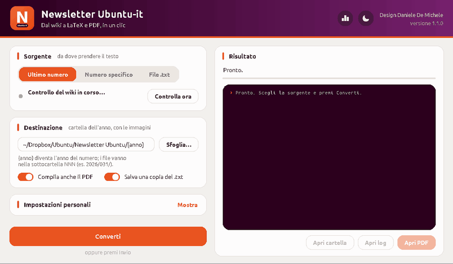
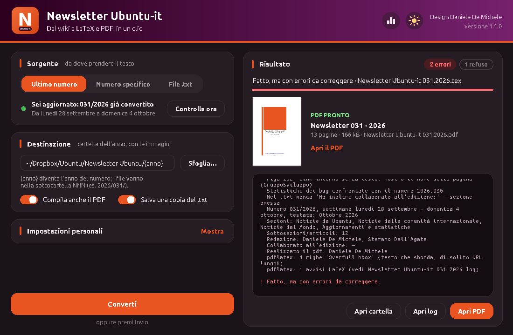
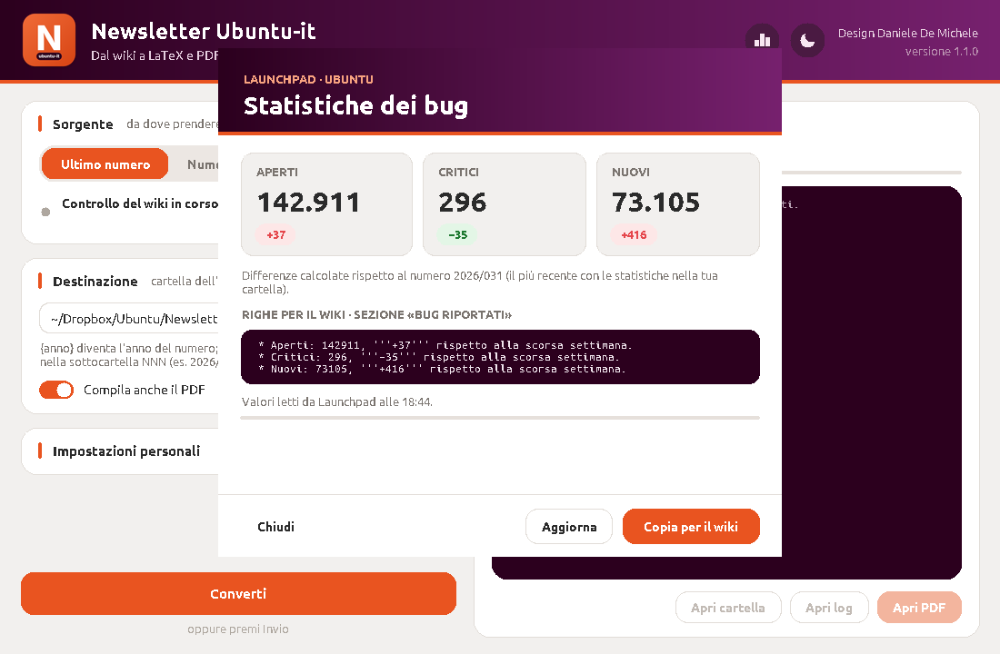

<p align="center">
  
</p>

<h1 align="center">newsletter2tex</h1>

<p align="center">
  Dal wiki di Ubuntu-it a LaTeX e PDF, in un clic.<br>
  Converte la <a href="https://wiki.ubuntu-it.org/NewsletterItaliana">Newsletter Ubuntu-it</a> dal formato wiki (MoinMoin) al file <code>.tex</code> dell'edizione PDF.
</p>

<p align="center">
  <a href="https://github.com/danieledemichele/newsletter2tex/actions/workflows/test.yml"></a>
  
  
  
</p>



## Cosa fa

Ogni settimana gli articoli della newsletter vengono scritti sul wiki e poi impaginati in LaTeX per l'edizione PDF. `newsletter2tex` automatizza questo passaggio:

- **Controlla il wiki** all'avvio e avvisa con un popup quando esce un numero non ancora convertito, mostrando settimana e titoli degli articoli. Con **Procedi** scarica il testo, lo converte e compila il PDF.
- **Converte il markup wiki** in LaTeX: sezioni, grassetto e corsivo, link interni ed esterni, liste annidate, righe "Fonte", statistiche del gruppo sviluppo, crediti.
- **Applica il template** dell'edizione PDF: frontespizio, colophon, indice, "Scrivi per la newsletter" e chiusura, con numero, anno, mese e date sempre aggiornati.
- **Segnala cosa correggere** nel testo prima della pubblicazione: markup non riconosciuto, link senza testo, apici non chiusi, refusi. Tutto è ordinato per riga del `.txt`.
- **Ti avvisa quando esce un nuovo numero** con una notifica sul desktop, il lunedì sera e il martedì, anche a programma chiuso.
- **Si aggiorna da solo** da GitHub all'avvio.
- **Legge le statistiche dei bug da Launchpad**, calcola le differenze con la settimana precedente e controlla che i numeri scritti nel `.txt` tornino.
- **Tiene un log di sistema**: ogni avvio, ogni conversione e soprattutto ogni errore vengono registrati in un file, così quando qualcosa non va basta guardare lì.
- **Funziona sia con l'interfaccia grafica sia da terminale.** È un unico file Python, senza dipendenze esterne.

## Installazione

Requisiti: Ubuntu (o un'altra distribuzione Linux), Python 3.8 o superiore, `python3-tk` per l'interfaccia grafica e una distribuzione TeX con il supporto per l'italiano per compilare il PDF.

```bash
sudo apt install python3-tk texlive-latex-extra texlive-science texlive-lang-italian
git clone https://github.com/danieledemichele/newsletter2tex.git
cd newsletter2tex
sh installa.sh
```

`installa.sh` copia il programma in `~/.local/bin/newsletter2tex`, aggiunge **Newsletter Ubuntu-it** al menu delle applicazioni con la sua icona, attiva l'avviso dei nuovi numeri e segnala eventuali pacchetti mancanti.

Dalla versione 1.2.0 il programma **si aggiorna da solo**. A ogni avvio controlla su GitHub se c'è una versione più recente; se c'è, la scarica, verifica che il file sia integro, sostituisce la copia installata e si riavvia dopo qualche secondo. Se stai convertendo, il riavvio aspetta la fine del lavoro; con «Più tardi» la nuova versione verrà usata al prossimo avvio. L'aggiornamento automatico si può spegnere nelle impostazioni personali; da terminale si aggiorna con `newsletter2tex --aggiorna`.

Per controllare quale versione è installata:

```bash
newsletter2tex --versione
```

## Interfaccia grafica

Si apre dal menu delle applicazioni oppure con:

```bash
newsletter2tex --gui
```

| Risultato con anteprima del PDF | Modalità notte |
|---|---|
|  |  |
| **Nuovo numero disponibile** | **Esplora file** |
|  |  |

- **Sorgente**:
  - **Ultimo numero**: lo stato del wiki, con il pulsante "Controlla ora".
  - **Numero specifico**: un numero preciso, per esempio `2026.031`.
  - **File .txt**: un file già salvato.

  Con "Ultimo numero" non viene scaricato niente senza la tua conferma. Se ti sei perso più numeri, nel popup puoi spuntare anche quelli precedenti.
- **Destinazione**: la cartella dell'anno, cioè quella con le immagini. `{anno}` viene sostituito con l'anno del numero.
- **Esplora file**:
  - posizioni rapide come Home, Scaricati, Dropbox e la cartella della newsletter;
  - percorso cliccabile e ricerca;
  - i file `.txt` più recenti in alto, con l'ultimo già selezionato.

  Scorciatoie: `Ctrl+L` per scrivere un percorso, `Ctrl+H` per i file nascosti, `Backspace` per salire di una cartella.
- **Impostazioni personali**: il nome per "A cura di", chi realizza il PDF, i collaboratori predefiniti all'edizione e gli interruttori per l'avviso dei nuovi numeri e gli aggiornamenti automatici. In fondo c'è il collegamento **Apri il log di sistema**. Le impostazioni vengono salvate in `~/.config/newsletter2tex/config.json` e valgono anche da terminale, così ogni collaboratore inserisce i propri dati una sola volta.
- **Risultato**:
  - errori, avvisi e refusi raggruppati per riga;
  - le etichette colorate in alto funzionano da filtro: cliccandole si nascondono o si mostrano errori, avvisi o refusi;
  - anteprima della copertina del PDF, con numero di pagine e dimensione;
  - pulsanti per aprire la cartella, il log e il PDF.
- **Modalità giorno/notte**: il pulsante con la luna (o il sole) nell'intestazione cambia tema con una dissolvenza, nella stessa finestra e senza perdere il lavoro in corso. Al primo avvio il programma segue l'impostazione chiaro/scuro di Ubuntu, poi ricorda la tua scelta.
- **Schermi piccoli**: la colonna di sinistra scorre con la rotella del mouse e il pulsante **Converti** resta sempre visibile.

## Avviso dei nuovi numeri

Il nuovo numero esce di solito tra il lunedì notte e il martedì. `installa.sh` attiva un timer di sistema che controlla il wiki il **lunedì alle 21:30** e il **martedì alle 8:15, 13:15 e 19:15**, più un ultimo controllo il **mercoledì alle 9:15**. Se il computer era spento, il controllo viene recuperato alla riaccensione. Quando trova un numero non ancora convertito manda una notifica sul desktop, una sola volta per numero; dove Ubuntu lo permette, la notifica ha il pulsante **Apri** che avvia il programma.

A programma aperto il wiki viene ricontrollato ogni 45 minuti e un nuovo numero compare come banner sotto l'intestazione.

```bash
newsletter2tex --notifiche stato    # è attivo?
newsletter2tex --notifiche off      # disattiva (on per riattivare)
```

Lo stesso interruttore è nelle impostazioni personali.

## Statistiche dei bug

Il pulsante con il grafico nell'intestazione legge da [Launchpad](https://launchpad.net/ubuntu) i bug di Ubuntu **aperti**, **critici** e **nuovi**. Poi calcola le differenze con il numero più recente presente nella tua cartella e prepara le righe da incollare nella sezione «Bug riportati» del wiki, con il pulsante **Copia per il wiki**.



Da terminale:

```bash
newsletter2tex --statistiche
```

Il conteggio dei bug aperti è una richiesta pesante per Launchpad e può richiedere fino a un minuto. Se va in timeout, il programma somma da solo i singoli stati aperti.

Durante la conversione il programma confronta anche le statistiche del `.txt` con quelle del numero precedente, preso dalla tua cartella o, se manca, dal wiki. Se una differenza scritta non torna, la segnala come **ERRORE**; se i valori sono identici alla settimana prima, avvisa che forse non sono stati aggiornati.

## Uso da terminale

```bash
newsletter2tex --controlla              # c'è un numero nuovo da convertire?
newsletter2tex --statistiche            # righe per il wiki con i bug da Launchpad
newsletter2tex --aggiorna               # aggiorna il programma da GitHub
newsletter2tex --notifiche on|off|stato # avviso dei nuovi numeri
newsletter2tex --log                    # dove si trova il log di sistema e le ultime righe
newsletter2tex                          # scarica e converte l'ultimo numero
newsletter2tex -n 2026.031              # scarica e converte un numero preciso
newsletter2tex -f vecchio.txt           # converte un file .txt già salvato
newsletter2tex --pdf                    # compila anche il PDF
newsletter2tex -o ~/altra/cartella      # usa un'altra cartella dell'anno
newsletter2tex --edizione 'garakkio:Massimiliano Arione'
                                        # collaboratori all'edizione (sostituisce quelli del .txt)
```

## Dove finiscono i file

Ogni numero ha una propria sottocartella dentro la cartella dell'anno (predefinita: `~/Dropbox/Ubuntu/Newsletter Ubuntu/<anno>/`):

```
Newsletter Ubuntu/2026/
├── newlogo1.png, newlogo2.png, Facebook.png, …    ← immagini del template
└── 031/
    ├── Newsletter Ubuntu-it 031.2026.tex
    ├── Newsletter Ubuntu-it 031.2026.pdf
    ├── NewsletterItaliana_2026.031.txt            ← copia del testo scaricato
    └── Newsletter Ubuntu-it 031.2026.conversione.log
```

Le immagini del template (`newlogo1.png`, `newlogo2.png`, `Facebook.png`, `Twitter.png`, `YouTube.png`, `Telegram.png`) vengono cercate nella cartella del numero, nella cartella dell'anno e nelle rispettive sottocartelle `Immagini/`.

## Regole di conversione

| Wiki | LaTeX |
|---|---|
| `= Titolo =` / `== Titolo ==` / `=== Titolo ===` | `\section` / `\subsection` / `\subsubsection` |
| `'''grassetto'''` | `\textbf{…}` |
| `''corsivo''` e `**testo**` | `\textit{…}` |
| `{{{testo}}}` | `\textsl{…}` |
| `` `codice` `` · `^apice^` · `,,pedice,,` | `\texttt` · `\textsuperscript` · `\textsubscript` |
| `[[https://url \| testo]]` | `$\href{https://url}{\textsl{testo}}$` |
| `[[PaginaWiki \| testo]]` e `[[Ubuntu:Pagina \| testo]]` | link completi a `wiki.ubuntu-it.org` e `wiki.ubuntu.com` |
| liste ` * ` e ` 1. `, anche annidate | `itemize` / `enumerate` |
| righe `''Fonte'': [[…]]` consecutive | un unico blocco "Fonte" in fondo all'articolo |
| `=== Nome ===` + lista in "Statistiche del gruppo sviluppo" | elenco puntato per sviluppatore |
| `!CamelCase` (escape del wiki) | `CamelCase` |
| `# _ % $ & { } ~ ^ \` | caratteri LaTeX escapati |

La sezione **Commenti e informazioni** viene letta per i crediti:

- *In questo numero hanno partecipato alla redazione degli articoli:* → redazione;
- *Ha inoltre collaborato all'edizione:* → collaboratori all'edizione (se manca, si usano le impostazioni);
- *Ha realizzato il pdf:* → realizzazione del PDF (se manca, si usano le impostazioni).

Ogni voce `[[utente | Nome Cognome]]` diventa un link a `https://wiki.ubuntu-it.org/utente`.

Il mese nell'intestazione è quello della domenica: la settimana dal 28 aprile al 4 maggio diventa "Maggio".

## Il log di conversione

Ogni conversione produce `Newsletter Ubuntu-it NNN.AAAA.conversione.log`, con i problemi elencati in ordine di riga del `.txt`. Per ogni riga c'è un estratto del testo e il punto esatto da correggere sul wiki. Un esempio è in [`esempi/esempio-log-con-problemi.log`](esempi/esempio-log-con-problemi.log).

| Livello | Cosa segnala |
|---|---|
| **ERRORE** | Cose che impediscono una conversione corretta: titoli con `=` sbilanciati, link non chiusi, autori mancanti, errori di pdflatex. |
| **AVVISO** | Markup sospetto o non riconosciuto: link senza testo o con testo vuoto, URL con spazi, apici o asterischi non chiusi, macro `<<…>>`, immagini `{{…}}`, tabelle, liste senza lo spazio iniziale, righe Fonte non standard o ripetute, sezioni vuote, articoli senza fonte, emoji. |
| **REFUSO** | Possibili errori di battitura: doppi spazi, spazio prima della punteggiatura o mancante dopo, parentesi e virgolette non chiuse, parole ripetute, *perchè*, *nè*, *pò* e simili. |
| **INFO** | Riepilogo del numero: settimana, sezioni, articoli, crediti. |

## Se il wiki blocca il download

`wiki.ubuntu-it.org` usa una protezione anti-bot che a volte rifiuta le richieste automatiche. Nella finestra il programma lo gestisce da solo:

1. apre la pagina del numero nel browser;
2. tu la salvi con **Ctrl+S** nella cartella Scaricati, con il nome che propone il browser;
3. il programma si accorge del file, controlla che sia proprio quel numero e riprende la conversione da dove si era fermato.

Da terminale: apri `https://wiki.ubuntu-it.org/NewsletterItaliana/AAAA.NNN?action=raw` nel browser, salva la pagina e usa `newsletter2tex -f file.txt`.

## Se qualcosa non funziona: il log di sistema

Ogni volta che il programma si apre, dalla finestra, da terminale o dal controllo programmato del lunedì e martedì, scrive cosa succede in:

```
~/.local/state/newsletter2tex/newsletter2tex.log
```

Ci finiscono:
- **all'avvio**: versione del programma, di Python e di Tk, sistema operativo, percorso del programma e impostazioni principali;
- **durante l'uso**: controlli del wiki, conversioni con il riepilogo di errori, avvisi e refusi, blocchi anti-bot, aggiornamenti, cambi di tema, interruzioni e chiusura della finestra;
- **gli errori**, con tutti i dettagli tecnici (traceback): problemi di rete, errori di pdflatex, ma anche errori imprevisti dell'interfaccia o delle operazioni in sottofondo, che altrimenti si vedrebbero solo nel terminale.

Per leggerlo:
- dalla finestra: **Impostazioni personali → Apri il log di sistema**;
- da terminale: `newsletter2tex --log` mostra il percorso e le ultime 40 righe.

Il file non cresce all'infinito: superato 1 MB ricomincia, tenendo le tre versioni precedenti (`newsletter2tex.log.1`, `.2`, `.3`).

Se segnali un problema, apri una [issue su GitHub](https://github.com/danieledemichele/newsletter2tex/issues) e allega le ultime righe del log.

Il log di sistema riguarda il programma. Il log di conversione (`… .conversione.log`, descritto sopra) riguarda invece il testo di un singolo numero.

## Test

A ogni modifica GitHub Actions riconverte il numero di esempio e controlla che il risultato non cambi senza volerlo. Verifica anche conversione, crediti, date, controlli del log, statistiche, aggiornamenti, notifiche e log di sistema, compila davvero il PDF con LaTeX e prova l'interfaccia grafica su uno schermo virtuale. Per eseguire i test in locale:

```bash
python3 -m unittest discover -s tests -v    # test della conversione
python3 tests/compila_pdf.py                # compilazione completa del PDF
xvfb-run -a python3 tests/prova_gui.py      # prova dell'interfaccia grafica
```

Se una modifica al codice cambia volutamente il `.tex` prodotto, va rigenerato il file di riferimento in `tests/attesi/`.

## Provare senza toccare il wiki

Nella cartella [`esempi/`](esempi/) c'è il testo del numero 2025.011:

```bash
newsletter2tex -f esempi/NewsletterItaliana_2025.011.txt -o /tmp/prova --pdf
```

## Struttura del repository

```
newsletter2tex.py        il programma (conversione, interfaccia grafica, terminale)
installa.sh              installazione e aggiornamento per l'utente corrente
newsletter2tex.desktop   voce del menu applicazioni
esempi/                  un numero di prova e un log di esempio
tests/                   test automatici e prova di compilazione del PDF
.github/workflows/       test eseguiti da GitHub Actions a ogni modifica
docs/                    icona, schermate e animazione per questo README
```

## Novità

**1.3.0**
- Log di sistema in `~/.local/state/newsletter2tex/newsletter2tex.log`: avvio, operazioni ed errori con i dettagli tecnici, compresi quelli dell'interfaccia e delle operazioni in sottofondo.
- Collegamento «Apri il log di sistema» nelle impostazioni personali e comando `newsletter2tex --log`.

**1.2.0**
- Il cambio giorno/notte avviene nella stessa finestra, con una dissolvenza, senza chiuderla e riaprirla.
- Aggiornamento automatico da GitHub all'avvio, con verifica del file scaricato e riavvio da solo.
- Blocco anti-bot: il programma apre la pagina nel browser, aspetta il file salvato in Scaricati e riprende da solo.
- Avviso dei nuovi numeri con notifica desktop il lunedì sera e il martedì (timer di systemd), e controllo ogni 45 minuti a programma aperto.

**1.1.2**
- Corretto il blocco della finestra quando il mouse passava sui pulsanti dell'intestazione (statistiche e giorno/notte): ogni ridisegno generava un nuovo evento del mouse, in un ciclo infinito.
- Corretti gli errori «invalid command name … interruttore» dopo la chiusura del popup del nuovo numero.
- Nuova prova automatica dell'interfaccia grafica su GitHub Actions (mouse sui pulsanti, popup, esplora file, cambio di tema).

**1.1.1**
- Corretto il blocco durante il download dei numeri arretrati: ogni download ha ora un limite di tempo (con un secondo tentativo), e mentre il programma lavora il pulsante **Converti** diventa **Interrompi**, con i secondi trascorsi accanto allo stato.
- I testi già scaricati durante il controllo del wiki vengono riusati, senza richiederli di nuovo.
- I numeri già convertiti vengono riconosciuti anche se fatti a mano prima del programma (un `.tex` o `.pdf` con «NNN.AAAA» nel nome, nella cartella dell'anno o in una sua sottocartella). I numeri arretrati vengono proposti solo fino all'ultimo già convertito.
- Il pulsante «Controlla ora» non viene più tagliato quando lo stato del wiki è lungo.

**1.1.0**
- Statistiche dei bug da Launchpad, con le righe pronte per il wiki e il controllo delle differenze durante la conversione.
- Modalità giorno/notte, che al primo avvio segue il tema di Ubuntu.
- Anteprima della copertina del PDF, etichette-filtro nella console e colonna di sinistra scorrevole.
- Corretto il testo della licenza nel colophon: accenti (paternità, modalità, È) e il «non» mancante in «ma non con modalità tali da suggerire…».
- Test automatici e GitHub Actions.

**1.0.0**
- Prima versione: conversione, interfaccia grafica, controllo dei nuovi numeri, log con errori, avvisi e refusi.

## Crediti

**Design:** Daniele De Michele ([dd3my](https://wiki.ubuntu-it.org/dd3my))

Realizzato per il [Gruppo Social Media](https://wiki.ubuntu-it.org/GruppoPromozione/SocialMedia) della comunità [Ubuntu-it](https://www.ubuntu-it.org). I contenuti della newsletter sono pubblicati con licenza [Creative Commons Attribution-ShareAlike 4.0](https://creativecommons.org/licenses/by-sa/4.0/).

Ubuntu è un marchio registrato di Canonical Ltd. Questo progetto non è affiliato a Canonical né approvato da Canonical.

## Licenza

Distribuito con licenza **GNU General Public License v3.0**: vedi il file [`LICENSE`](LICENSE).
